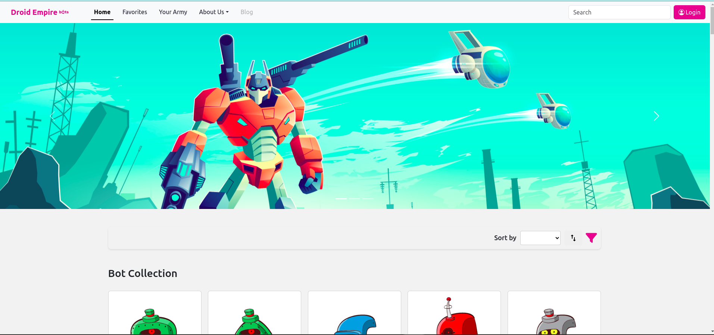
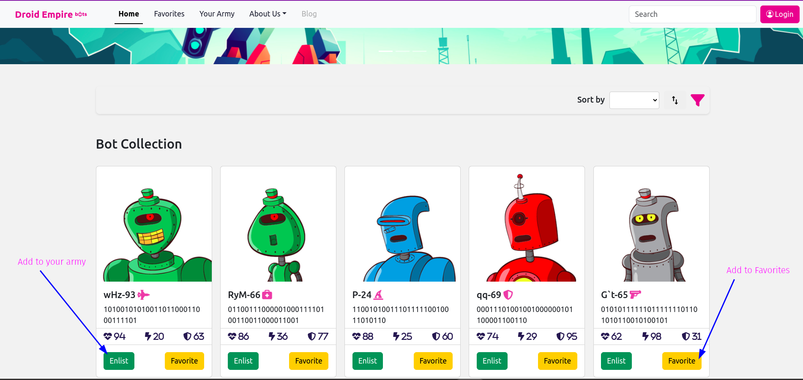
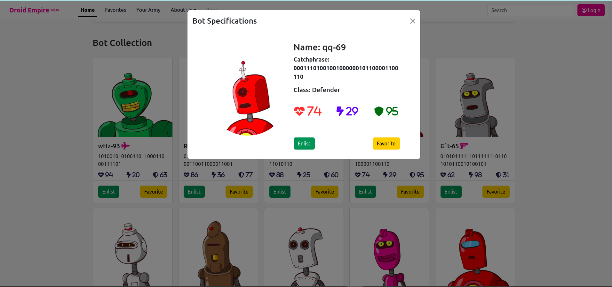
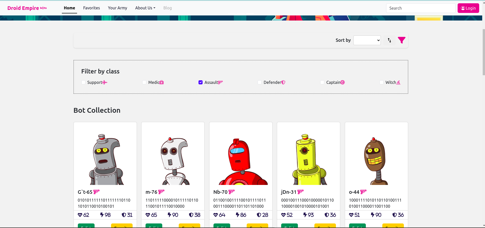
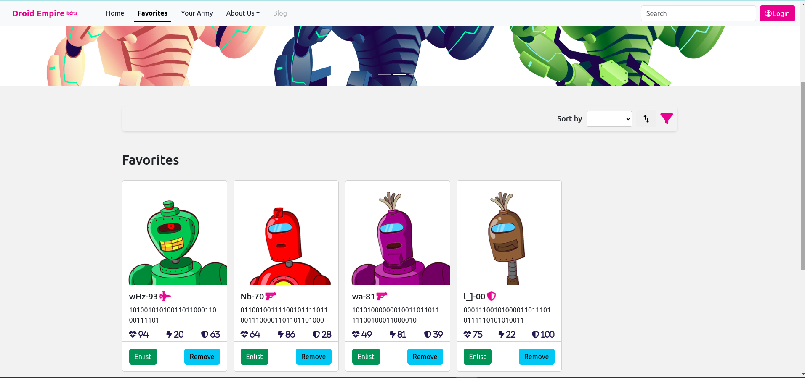
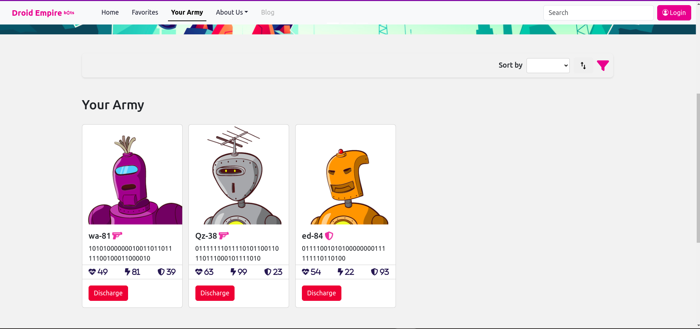
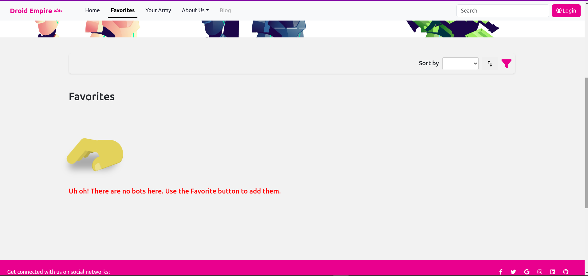

# Droid Empire

## Phase 2 : Week 2 Code Challenge

[](./LICENSE)
[](https://www.javascript.com)
[](https://react.dev/)
[](https://www.npmjs.com/)
[](https://pages.github.com/)

## Introduction

Droid Empire is a React web app built as part of Phase 2: Week 2 code challenge to practice on components, props, state, events, and data fetching in React.

This application is the one and only spot in the known universe where you
can custom build your own Bot Army! Core features include browsing through
a list of robots, viewing a robot's details, and enlist a bot into your army.

  

## Features

- View all bots on the homepage, use `Favorite` and `Enlist` buttons to add to favorites or enlist in your army.

  

- Click on an image to view a bot's specs

  

- `Filter` bots by class

  

- See your favorites

  

- See your army

  

- `Alert` if no bots found

  

## Dependencies

### Prerequisites

Before running this app, make sure you have the following installed on your system:

- Node.js (v18.15.0 or later)
- npm (v9.6.7 or later)

### Front-end Dependencies

- React (v18.2.0)
- React DOM (v18.2.0)
- React Scripts (v5.0.1)
- Bootstrap (v5.3.1)
- React Bootstrap (v2.8.0)
- React Modal (v3.16.1)
- React Router DOM (v6.14.2 or later)

## Project Setup

### 1. Clone the repository

```
git clone https://github.com/ArshavineRoy/droid-empire
```

### 2. Navigate to the project directory

```
cd droid-empire
```

### 3. Install required dependencies

In the project directory, install the required dependencies

```
npm install
```

### 4. Install and start JSON server

#### Install JSON server

```
npm install -g json-server
```

#### Start JSON Server

```
json-server --watch bots.json
```

- **Note:** Running this command will instruct `json-server` to use the `bots.json` file in the terminal's current directory, so make sure to run this command from the same directory as this project.

#### Test the server by visiting this route in the browser

```
http://localhost:3000/bots
```

Sample:

```json

  {
    "id": 101,
    "name": "wHz-93",
    "health": 94,
    "damage": 20,
    "armor": 63,
    "bot_class": "Support",
    "catchphrase": "1010010101001101100011000111101",
    "avatar_url": "https://robohash.org/nostrumrepellendustenetur.png?size=300x300&set=set1",
    "created_at": "2018-10-02T19:55:10.800Z",
    "updated_at": "2018-10-02T19:55:10.800Z"
  },
  {
    "id": 102,
    "name": "RyM-66",
    "health": 86,
    "damage": 36,
    "armor": 77,
    "bot_class": "Medic",
    "catchphrase": "0110011100000100011110100110011000011001",
    "avatar_url": "https://robohash.org/quidemconsequaturaut.png?size=300x300&set=set1",
    "created_at": "2018-10-02T19:55:10.827Z",
    "updated_at": "2018-10-02T19:55:10.827Z"
  },
]
```

### 5. Start the development server

```
npm start
```

This runs the app in the development mode.

### 6. Open your browser and interact with the app

The app will open on your default browser automatically when `npm start` is run, but if it doesn't, open [http://localhost:3000](http://localhost:3000) to view it.

You may also see any lint errors or logs in the console.

### Tree view of the component parent-child structure

```text
src
└── Components
	└── App
	    ├── Navbar
	    ├── Carousel
	    ├── Pages
	    │   ├── Sort
	    │   ├── Filter
	    │   ├── BotCollection
	    │   ├── BotModal
	    │   ├── Favorites
	    │   └── Army
	    └── Footer
```

## Code Challenge Deliverables

A user should be able to:

- See profiles of all bots rendered in `BotCollection`.
- Add an individual bot to their army by clicking on it. The selected bot should
  render in the `Army` component. The bot can be enlisted only **once**.
- The bot **does not** disappear from the `BotCollection`.
- Release a bot from their army by clicking on it. The bot disappears from the
  `Army` component.
- Discharge a bot from their service forever, by clicking the red button marked
  "x", which would delete the bot both from the backend and from the
  `Army` on the frontend.

## Bonus Deliverables

A user should be able to:

- Choose to enlist a bot into the army or just see their data. Clicking
  on the card should instead display a show view (`BotSpecs`) for that bot,
  which should replace `BotsCollection`. BotSpecs should have two buttons: one
  to go back to the list view and another to enlist that bot.
  
- Sort bots by their health, damage or armor. For this, create a new component,
  `SortBar`.
- When I enlist a bot, it will be **removed** from the `BotCollection` and added
  to `Army`.
- Filter bots by their class. We can select a few filters at the same time.
- Sort bots by their health, damage or armor. For this, create a new component,
  `SortBar`.
- Only enlist **one** bot from each `bot_class`. The classes are
  `["Support", "Medic", "Assault", "Defender", "Captain", "Witch"]`.

## Author & License

Authored by [Arshavine Waema](https://github.com/ArshavineRoy).

Licensed under the [MIT License](LICENSE) - see the [LICENSE](LICENSE) file for details.